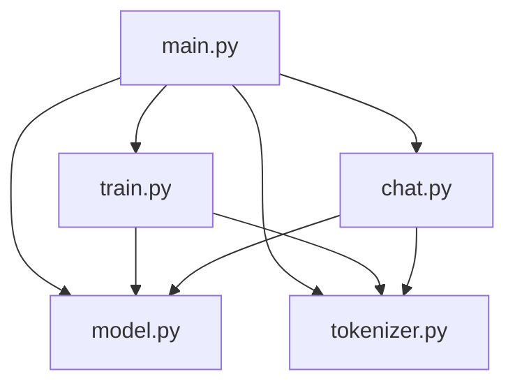

# LLM-from-scratch

[](https://pytorch.org/) [](./) [](https://www.gutenberg.org/policy/license.html)

> **A modular, professional, and educational implementation of a GPT-style next-token generator in PyTorch.**

---

## 🚀 Project Overview

**LLM-from-scratch** is a clean, modular, and extensible implementation of a GPT-style character-level language model. Designed for both learning and rapid prototyping, this project demonstrates modern ML engineering best practices, including:

- Clear separation of model, tokenizer, training, and inference logic
- Readable, well-documented code
- Easy extensibility for research and production prototyping
- Minimal dependencies (just PyTorch)

---

## 🏗️ Project Structure

```
LLM-from-scratch/
├── model.py        # Model classes (GPT, TransformerBlock, etc.)
├── tokenizer.py    # CharTokenizer and tokenization utilities
├── train.py        # Training loop and batch generation
├── chat.py         # Chat/interactive generation logic
├── main.py         # Entry point: loads data, trains, and launches chat
├── sample_chat_corpus.txt  # Training data (default: Alice in Wonderland)
├── README.md
└── requirements.txt
```

---

## 🧩 Architecture Diagram



---

## ✨ Features
- **Modern Transformer Architecture:** Multi-head causal self-attention, position-wise feedforward, custom LayerNorm
- **Character-level Tokenization:** No external dependencies
- **Next-token Generation:** Auto-regressive, temperature and top-k sampling
- **Interactive Chat:** CLI-based, easy to extend to web or API
- **Extensible & Readable:** Perfect for research, education, and prototyping

---

## 📚 Dataset
- Default: [Alice's Adventures in Wonderland](https://www.gutenberg.org/ebooks/11) (Project Gutenberg, public domain)
- Swap in any plain text file by replacing `sample_chat_corpus.txt`

---

## ⚡ Quickstart

1. **Clone the repository:**
   ```bash
   git clone https://github.com/sefineh-ai/LLM-from-scratch.git
   cd LLM-from-scratch
   ```
2. **(Optional) Create and activate a virtual environment:**
   ```bash
   python3 -m venv .venv
   source .venv/bin/activate
   ```
3. **Install dependencies:**
   ```bash
   pip install torch
   ```
4. **(Optional) Replace `sample_chat_corpus.txt` with your own text.**
5. **Train and chat:**
   ```bash
   python3 main.py
   ```

---

## 🛠️ Extensibility
- **Swap in your own tokenizer** (word-level, BPE, etc.) via `tokenizer.py`
- **Upgrade the model** (add layers, attention types, etc.) in `model.py`
- **Integrate with web or API** by extending `chat.py`
- **Experiment with datasets** by changing `sample_chat_corpus.txt`
- **Add logging, callbacks, or experiment tracking** as needed

---

## 📝 Example Output
```
You: The rabbit
AI:  was running very fast and Alice followed him down the hole.
```

---

## 🤝 Contributing
We welcome contributions, issues, and feature requests! Please open an issue or submit a pull request.

---

## 📄 License & Credits
- **Code:** MIT License or Public Domain (choose your preferred open license)
- **Dataset:** [Project Gutenberg, Alice's Adventures in Wonderland](https://www.gutenberg.org/ebooks/11) (public domain)

---

**Created and maintained by [Your Name or GitHub handle]** 